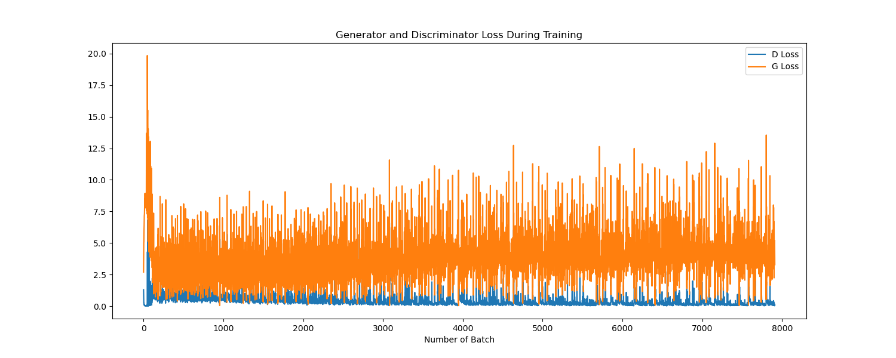
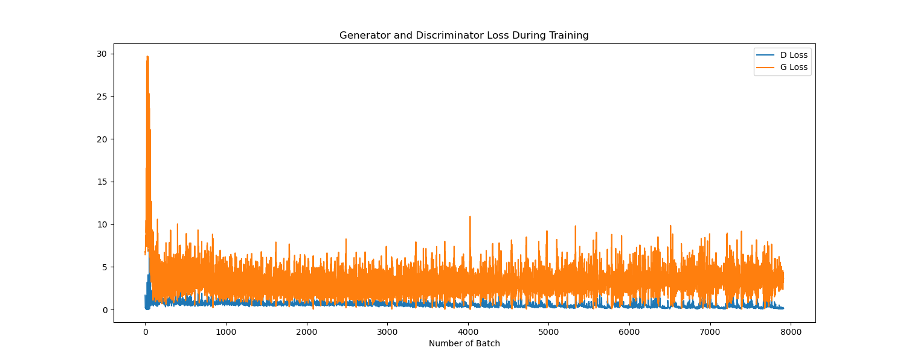
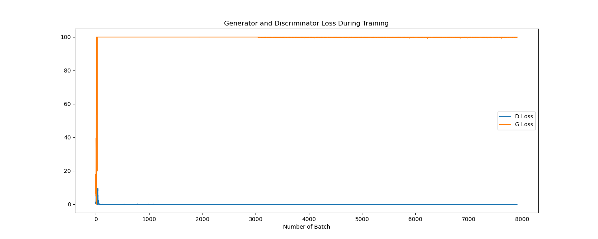
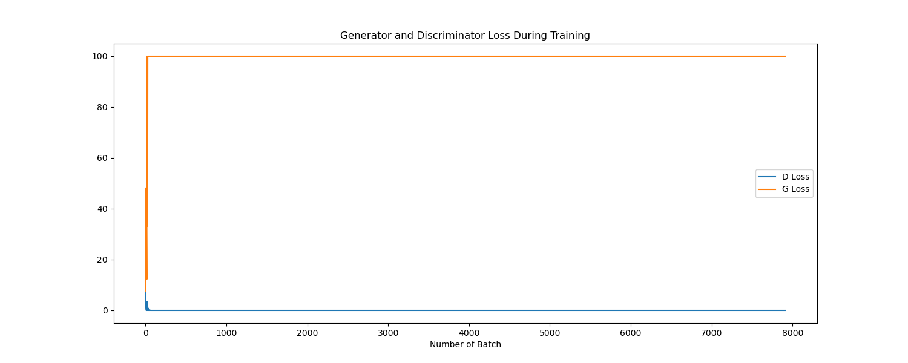

# FakeFaceGen-GAN 报告
生成的图请看 `Generate_no_opt` 或 `Generate_with_weight` 目录下的。  

## `network.py` 实现过程

- 配环境读 `README` 等必要过程
- 在网上搜索 `GAN` 和 `DCGAN` 的讲解视频，理解模型在干什么
- 在知乎上搜到 `GAN` 和 `DCGAN` 的具体实现（发现 `DCGAN` 和 `GAN` 的区别其实主要就在 Discriminator 和 Generator 类的定义中，导致训练/生成流程的不同）
- 看 `docs/nn-func.ipynb` 了解卷积层参数如何设定，以及上采样/下采样采用的不同卷积函数
- 看 `dataloader.py` 中图像的大小，结合知乎的实现，分别设定上采样/下采样的参数


## `train.py` 大致思想

`train.py` 中的训练过程基本上可以用如下伪代码来表示：  
```c++
for number of trainning iterations do
    for k steps do
    train Discriminator D
    train Generator G
    output training messages
    end for
end for
```
其中，`train Discriminator D` 主要流程是  
- `optimizerD` 清空梯度，应该是避免上一轮的梯度影响本轮优化
- 准备本轮训练使用的真实图像数据
- （label设为true）将真实图像样本输入 `D`，前向传播
- 计算判别器损失
- 反向传播计算 `D` 梯度
- 用 `Generator G` 生成假图像样本
- （label设为false）将假图像样本输入 `D`，前向传播
- 计算判别器损失
- 反向传播计算 `D` 梯度
- 计算判别器总损失
- 更新判别器参数

`train Generator G` 主要流程是
- `optimizerG` 清空梯度
- （label设为true）将用于更新 `D` 的图像样本输入判别器，前向传播，生成更真的图片
- 计算生成器损失
- 反向传播计算 `G` 梯度
- 更新生成器参数


## 额外实现
我注意到原本的训练中没有按照论文设置 pytorch 给卷积和 BatchNorm 函数的初始张量。

并且 `train.py` 中的训练过程和 `GAN` 论文中的 `mini-batch SGD` 训练方法不同（虽然 `DCGAN` 的论文中也采取 `Adam optimizer` 的训练方法。）  

我按照这两种优化方向单独/同时进行了优化。
- 加初始化张量
- 改用 `SGD optimizer` 训练
---

**这是原本的收敛图**（生成图片在 `Generate_no_opt` 目录下）  
Loss_no_opt.png  


**这是仅加初始化张量的收敛图**（生成图片在 `Generate_with_weight` 目录下）  
Loss_with_weight.png  


可以看到，判别器的收敛速度和收敛程度基本不变，而生成器的收敛速度不变但收敛程度明显提高。但是这在生成图片的质量上似乎并没有明显体现。


**这是仅改用 `SGD optimizer` 训练的收敛图**（生成图片在 `Generate_with_SGD` 目录下） 
Loss_with_SGD.png   


十分逆天的判别器收敛速度，生成的图像也全是噪声。遗憾离场。推测可能是因为 `SGD` 的收敛速度本身就很慢，训练集不够大；或者学习速度太快.


**这是同时有两个改动训练的收敛图**（生成图片在 `Generate_both` 目录下）  
Loss_both.png  

并没有改变十分逆天的判别器收敛速度，生成的图像依然是噪声。